# Marketing-Analysis
An Analysis of Marketing Campaigns to Obtain Insights of whether they have been successful or not.

### Background

In this project I will be stepping into shoes of a Marketing Analyst for a fictional company called Sustainable Clothing Co.

The Company has been running several marketing campaigns and my role is provide Insights on whether these campaigns have been succusseful or not.

### Data
The data used in the analysis is from Steel data SQL challenge 6 which can be found [here](https://www.steeldata.org.uk/sql6.html) 

The data is provided in the link above by running an SQL code to create a schema.
There are three tables named sustainable clothing, transactions and marketing campaigns.

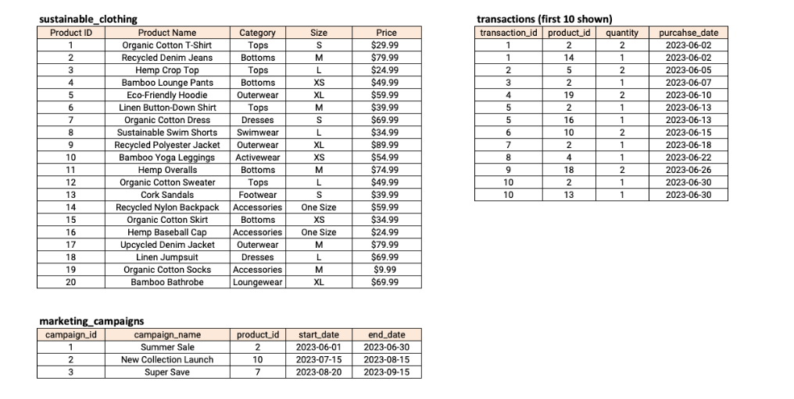


### Tools
**MySQL** - for analysis of the data

**Power Bi** - for data visualization

### Data Analysis

Am going to carry out the analysis based on the following problem statements.

The Problem statements are provided in the website above alongside the database shema code.

1. How many transactions were completed during each marketing campaign?
2. Which product had the highest sales quantity?
3. What is the total revenue generated from each marketing campaign?
4. What is the top-selling product category based on the total revenue generated?
5. Which products had a higher quantity sold compared to the average quantity sold?
6. What is the average revenue generated per day during the marketing campaigns?
7. What is the percentage contribution of each product to the total revenue?
8. Compare the average quantity sold during marketing campaigns to outside the marketing campaigns
9. Compare the revenue generated by products inside the marketing campaigns to outside the campaigns
10. Rank the products by their average daily quantity sold

### 1.How many transactions were completed during each marketing campaign?

```SQL
-- Number of Transactions completed during each marketing campaign

select 
mc.campaign_name, 
count(t.transaction_id) as Num_of_Transactins
from 
marketing_campaigns mc
inner join 
transactions t on mc.product_id = t.product_id
Group by
campaign_name
;
```

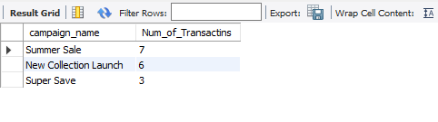

Summer Sale campaign had the most number of transactions.


### 2.Which product had the highest sales quantity?

```SQL
Select 
s.product_name,
sum(t.quantity)	as Total_Qty
from 
transactions t
Left join 
sustainable_clothing s on t.product_id = s.product_id
group by 
product_name
order by sum(t.quantity) Desc 
Limit 1;
```

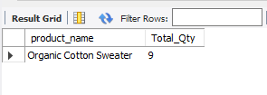

Organic Cotton Sweater had the highest sales quantity.

### 3. What is the total revenue generated from each marketing campaign?

```SQL
select 
mc.campaign_name,
sum(t.quantity * s.price) as Total_Revenue
from 
marketing_campaigns mc
join 
transactions t on mc.product_id = t.product_id
join 
sustainable_clothing s on t.product_id = s.product_id
Group by mc.campaign_name;
```

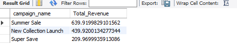

Summer Sale campaign had the highest revenue generated


### 4. What is the top-selling product category based on the total revenue generated?

```SQL
select 
s.category,
sum(s.price * t.quantity) as Revenue
from 
sustainable_clothing s
join 
transactions t on s.product_id = t.product_id
group by
category
order by Revenue Desc
Limit 1
```

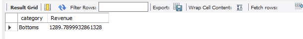

Bottoms is the top-selling product category.

### 5. Which products had a higher quantity sold compared to the average quantity sold?

```SQL
select 
s.product_name,
sum(t.quantity) as Total_Qty_Sold,
avg(t.quantity) as Avg_Qty_Sold
from 
transactions t
join 
sustainable_clothing s on t.product_id = s.product_id
group by product_name
Having Total_Qty_Sold > Avg_Qty_Sold
order by sum(quantity) desc ;
```

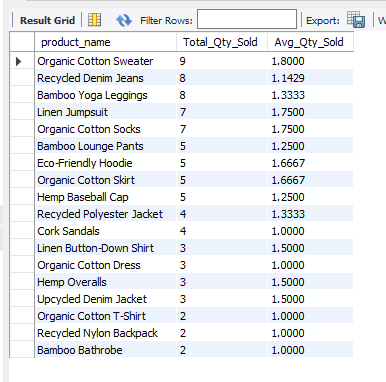

Organic Cotton Sweater, Recycled Denim Jeans, Bamboo Yoga Leggings etc are some of the products with higher sales quantity than average.

### 6. What is the average revenue generated per day during the marketing campaigns?

```SQL
with RevenueCTE AS
(select 
m.campaign_name as campaign_name,
sum(t.quantity * s.price) as Revenue
from 
marketing_campaigns m
join 
transactions t on m.product_id = t.product_id
join 
sustainable_clothing s on t.product_id = s.product_id
group by campaign_name),

DateCTE AS (
Select 
campaign_name,
(end_date - start_date) as Tot_Number_of_Days
from marketing_campaigns)

select 
r.campaign_name,
r.Revenue,
dt.Tot_Number_of_Days,
(r.Revenue/dt.Tot_Number_of_Days) as Avg_Revenue_Per_Day
from RevenueCTE r
join DateCTE dt on r.campaign_name = dt.campaign_name
```

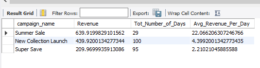

Once again, Summer Sale had the highest average revenue generated per day.


### 7. What is the percentage contribution of each product to the total revenue?

```SQL
with RevCTE AS (
select 
s.product_name as Product_Name,
sum(t.quantity * s.price) as Total_Revenue
from 
transactions t
join 
sustainable_clothing s on s.product_id = t.product_id
Group by product_name
)
select 
Product_Name,
total_revenue*100/(SUM(total_revenue) OVER()) AS Pct_Revenue
from 
RevCTE
Group by
Product_Name
ORDER BY
Pct_Revenue DESC
```

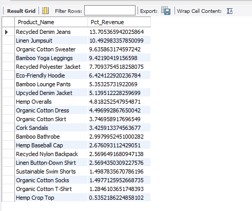

Recycled Denim Jeans contributed maximum while Hemp Crop Top contributed the least in terms of revenue.


### 8. Compare the average quantity sold during marketing campaigns to outside the marketing campaigns

```SQL
WITH outside_campaign_cte AS (
SELECT 
SUM(t.quantity) AS out_campaign_quantity
FROM transactions t 
LEFT 
JOIN 
marketing_campaigns m ON t.product_id = m.product_id
WHERE m.product_id IS NULL),

during_campaign_cte AS (
SELECT 
SUM(t.quantity) AS in_campaign_quantity
FROM transactions t 
JOIN 
marketing_campaigns m ON t.product_id = m.product_id
)
SELECT 
out_campaign_quantity, 
in_campaign_quantity
FROM 
outside_campaign_cte 
JOIN 
during_campaign_cte;
```

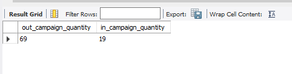


Quantity sold outside the marketing campaign is significantly higher than the one sold inside the marketing campaign.

### 9. Compare the revenue generated by products inside the marketing campaigns to outside the campaigns

```SQL
with firstCTE as (
select 
round(sum(t.quantity * s.price),2) as revenue_outside_campaign
from
transactions t
join 
sustainable_clothing s on t.product_id = s.product_id
left join
marketing_campaigns m on t.product_id = m.product_id
where 
m.product_id is null),

secondCTE as (
select 
round(sum(t.quantity * s.price),2) as revenue_within_campaign
from
transactions t
join 
sustainable_clothing s on t.product_id = s.product_id
join
marketing_campaigns m on t.product_id = m.product_id
)

select 
revenue_outside_campaign,
revenue_within_campaign
from firstCTE
join
secondCTE
```

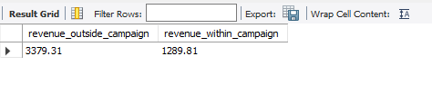


Revenue generated outside the marketing campaign is significantly higher than the one sold inside the marketing campaign

### 10. Rank the products by their average daily quantity sold

```SQL
select 
s.product_name,
avg(t.quantity) as Avg_Qty,
dense_rank() over (order by avg(t.quantity)desc ) as rnk
from 
transactions t
join 
sustainable_clothing s on t.product_id = s.product_id
group by product_name
 ;
```

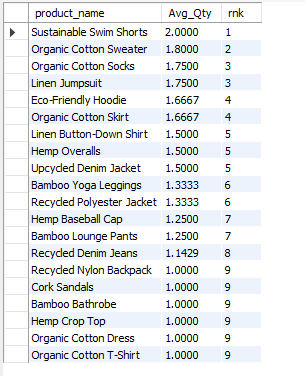

This concludes SQL-Steel Data Marketing Analysis challenge based on the ten analysis questions.

Below is a snapshot of the Power Bi visualizations for some of the KPI in the above findings.


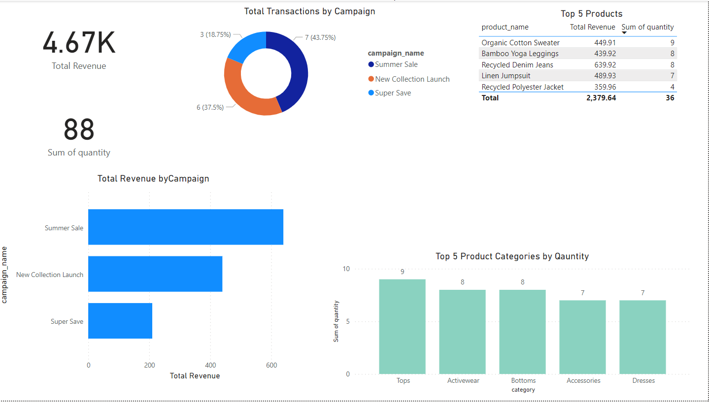
